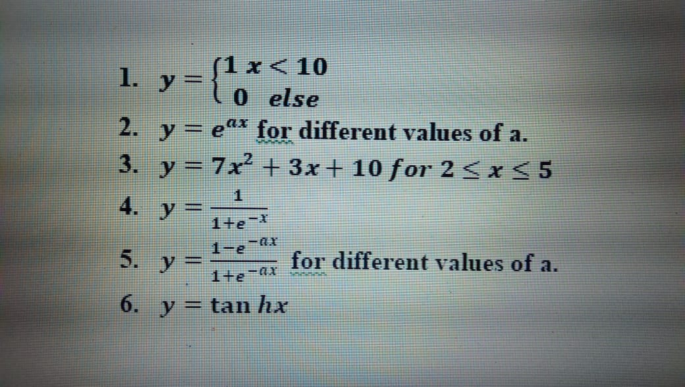

# Softcomputing-Laboratory-Programs

## Objectives

>> Date: 5-10-2020
1. Learning of various environment which can be used for python programming.
2. Write a program to implement all operators in python
3. Make a list of any 6 libraries of Python with their functionality in brief. And, also write the steps required for installing any new library in a given environment

>> Date: 10-10-2020
4. Write a program to implement various data structures in python and their operations.
5. Demonstrate the use of Numpy for matrix operations
6. Demonstrate the use of Matplotlib library

>> Date: 19-10-2020
7. 

